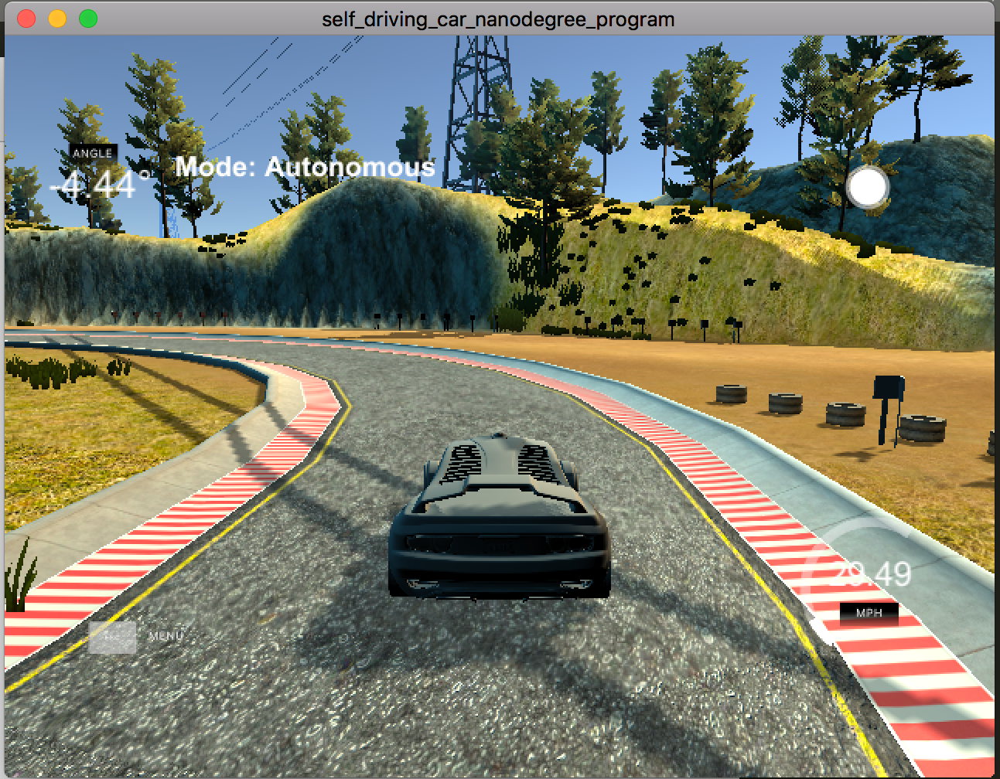
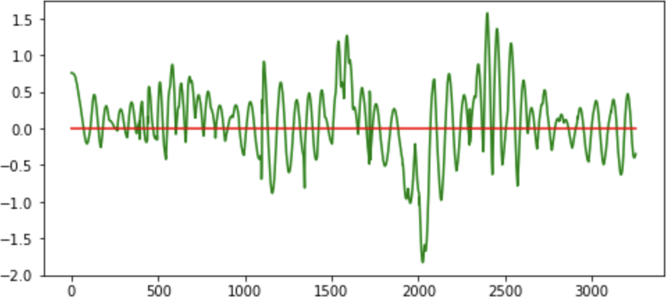

# CarND-Controls-PID
Self-Driving Car Engineer Nanodegree Program

---

## Writeup

#### PID Controller
The PID controller is made up of 3 components as follows:
* Proportional (P) : This component is used to reduce the CTE error. The higher the value of P value, the car will steer harder towards the state of minimizing CTE. As a result, this may result in overshooting of the car from the desired place when CTE is minimized as P controller will not realize this until CTE again starts increasing.

* Derivative (D) : The D component gives the derivative of CTE in relation to time step. This component helps in avoiding overshooting by the P controller and thus avoids oscillations of car going like a sine wave. The D controller adds resistance so as the CTE is approaching towards minimum, the steering of car is reduced.

* Integral (I) : The I component is used to overcome any bias present in the underlying car.

#### Parameter tuning
The initial parameters for the car's steering PID were chosen using manual tuning. By running the simulator, I tuned the initial parameters by first changing only P value, then changing D value and finally I value. The parameters obtained with manual tuning were P (0.15), D (1.25), I (0.0001).

Once manual tuning was done, in order to perfect the car path in simulator with less oscillations, I implemented twiddle algorithm to fine tune the manual parameters.

At the end of twiddle algorithm, the tuned parameters had value P (0.151), D (1.783), I (0.0001567).

The below image shows the car in simulator with above PID parameters

#### Results
The below image shows the CTE observed at every step car takes in one lap of the simulator.

